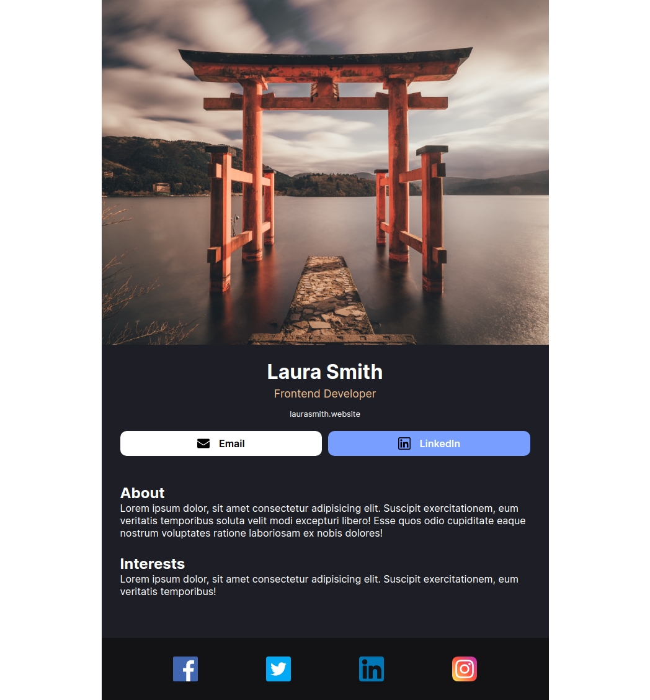
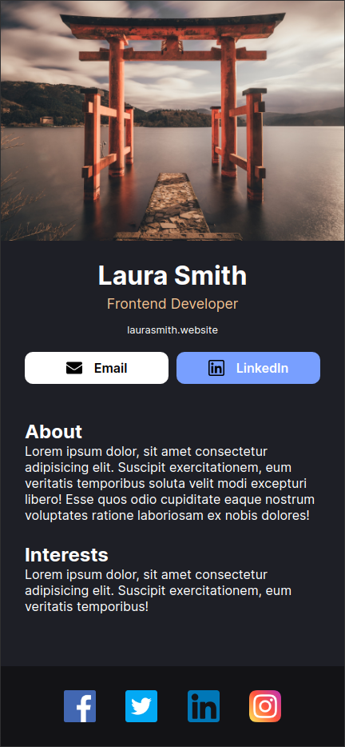

# Scrimba React Project #2: Digital business card

The goal of this solo project was to create a digital business card in React.

I started and finished this project in April 2023.

## Assignment

[Scrimba - Learn React - #2 Solo project: Digital business card](https://scrimba.com/learn/learnreact)

## Technology

- React
- JavaScript
- Vite
- CSS

## Key Concepts

- Vite setup
- JSX
- Custom components

## Links

[Live Demo](https://brightneon7631.github.io/scrimba-digital-business-card/)

[My Other Projects](https://brightneon7631.github.io/odin-scrimba-projects/)

## Screenshots

### Desktop



### Mobile



## Sources

- <a href="https://www.flaticon.com/free-icons/facebook" title="facebook icons">Facebook icons created by Freepik - Flaticon</a>
- <a href="https://www.flaticon.com/free-icons/linkedin" title="linkedin icons">Linkedin icons created by Freepik - Flaticon</a>
- <a href="https://www.flaticon.com/free-icons/twitter-logo" title="twitter logo icons">Twitter logo icons created by Md Tanvirul Haque - Flaticon</a>
- <a href="https://www.flaticon.com/free-icons/instagram" title="instagram icons">Instagram icons created by Pixel perfect - Flaticon</a>
- <a href="https://www.flaticon.com/free-icons/email" title="email icons">Email icons created by Freepik - Flaticon</a>
- <a href="https://www.flaticon.com/free-icons/linkedin" title="linkedin icons">Linkedin icons created by IconsBox - Flaticon</a>
- https://unsplash.com/photos/SBK40fdKbAg by Tianshu Liu
- https://fonts.google.com/specimen/Inter

## Deployment

```bash
# clone repo
git clone

# install project dependencies
npm install

# run vite dev server
npm run dev

# create a production build
npm run build
```
